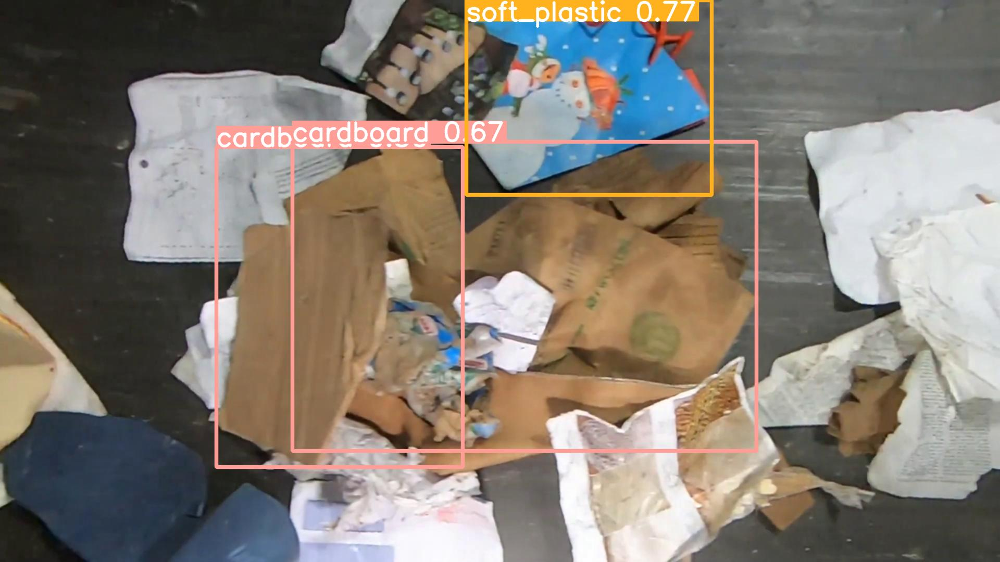
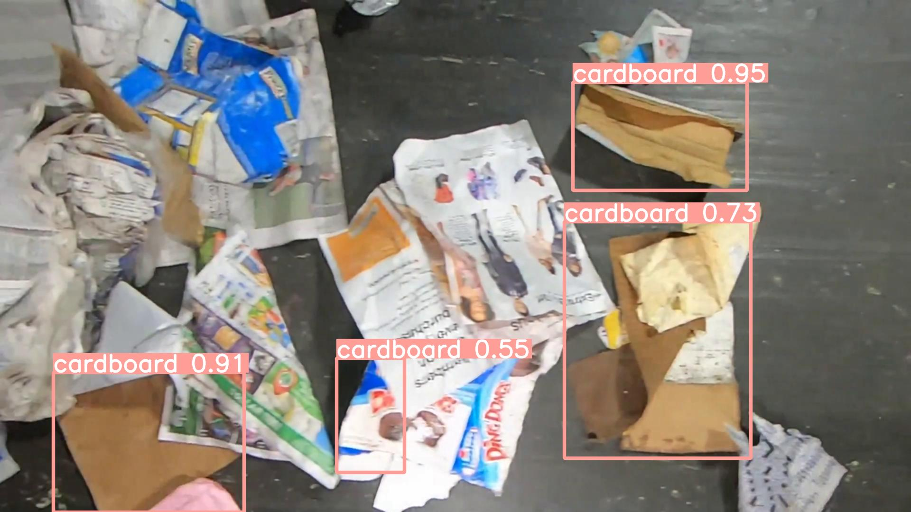
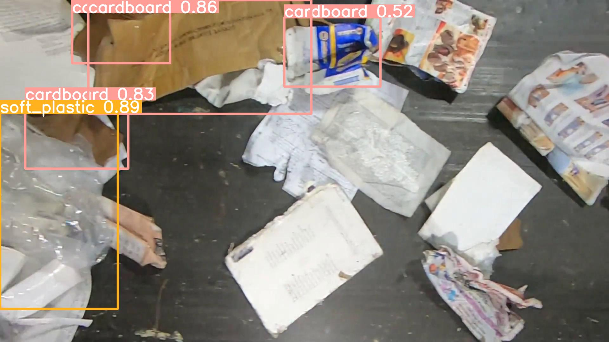
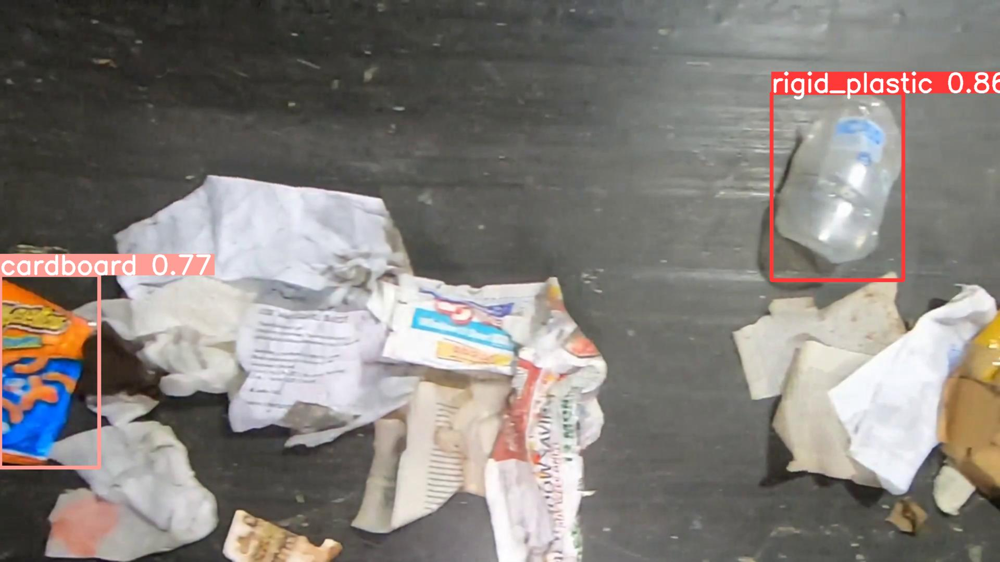

<h1>Waste Detection</h1>

    <h3>Problem Statement</h3>
    

        In modern day society, a huge amount of waste is generated everyday.
Some are biodegradable and some are not. The goal of this project is to detect
the common wastages which are not biodegradable or takes time to degrade.
    

    <h3>Solution</h3>
    

        I trained a yolov5 detector which can detect cardboard, soft plastic, rigid 
plastic and metals from the waste. It can be used in different machines to extract
these materials from waste. I also implemented an API which takes base64 string
of image as input and returns the image in base64 with detections of the target
materials and other parameters like detection score, bbox coordinates as output.
    

    <h3>How to use the API?</h3>
    <ul>
        <li>Convert image to base64 string.</li>
        <li>Install python 3.10.</li>
        <li>Run: pip install -r requirements.txt</li>
        <li>Run: uvicorn main:app</li>
        <li>Visit: http://127.0.0.1:8000/docs</li>
        <li>Use interface to give the base64 string as input.</li>
        <li>Get predictions.</li>
        <li>To visualize the predicted image convert base64 string to image.</li>
    </ul>

    <h3>Conclusion</h3>
    

        The main challenge of the project is that objects are overlapping on
each other and the dataset is highly imbalanced. YOLOV5 is working fine on the
dataset. AS, YOLOV5 has good mAP score and low inference time that's why I choose
this algorithm. On this dataset, it is showing a decent performance but it
is showing some biasness towards majority class(Cardboard). With image augmentation
and training with higher eopchs, this problem can be eliminated. Due to hardware
limitations I failed to train on augmentation dataset as the size became very large
and I trained the current model with 50 epochs only.
    

    <h3>Results</h3>
    

For detailed results: Check - yolov5/runs

    
    

Labels

    
    

Confusion Matrix with Default IoU(0.3). With IoU(0.5) False Positives
are decreased significantly.

    

        <strong>
Test Images
</strong>
        
        
        
        
    

